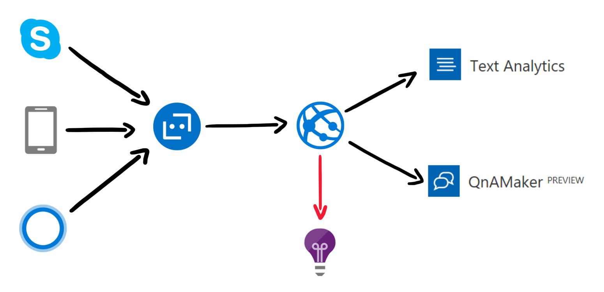

# Multilingual Q&A Bot Sample



This sample was built to demonstrate an approach to detecting the language of a question of forwarding it to the correct QnA Knowldgebase.

Each message is received and sent to the Text Analytics Congnitive Service. From the response, we select the language with the highest score and use it to forward the users question the the correct QnA Knowledgebase.


To deploy this sample, from the [Azure Portal](http://portal.azure.com) create an [Application Insights](https://docs.microsoft.com/en-us/azure/application-insights/) and place the instrumentation key in **ApplicationInsights.config**.

```
<InstrumentationKey> {VALUE} </InstrumentationKey>
```

Then, create two KBs at [qnamaker.ai](https://qnamaker.ai/). From this service, you need to collect the subscription key and individual KB IDs.

Using these IDs, edit **QnADialogFr.cs** and **QnADialogEn.cs**.

```
[QnAMaker(subscriptionKey: "<QnAMaker Subscription Key>",
            knowledgebaseId: "<QnA Maker KB ID>",
            scoreThreshold: 0.5D,
            top: 3)]
```

With the [Active Learning](https://qnamaker.ai/Documentation/ActiveLearning) feature, users can now help auto-learn from question variations and get them added to the knowledge base.
To activate this feature set the **top** parameter to a number that is greater than 1.

> The active learning process kicks in after every 50 feedbacks sent to the service via the Train API. 

The new QnAMakerDialog now does the following:
- Get the TopN matches from the QnA service for every query above the threshold set.
- If the top result confidence score is significantly more than the rest of the results, show only the top answer.
- If the TopN results have similar confidence scores, then show the prompt dialog with TopN questions.
- Once the user selects the right question that matches intent, show the answer for that corresponding question.
- This selection also triggers a feedback into the QnAMaker service via the Train API, described below. 

> Remember that the learnt QnAs and the alterations need to be published explicitly by the developer, to impact the production endpoint. 

Then from the [Azure Portal](http://portal.azure.com), create a [Text Analytics API](https://azure.microsoft.com/en-us/services/cognitive-services/text-analytics/). This Cognitive Service is used for Language detection. It can identify 120 languages and returns each detected language with a numeric score between 0 and 1. Scores close to 1 indicate 100% certainty that the identified language is true.
Copy the primary key from the **Keys** blade and update the **SubscriptionKey** located in the **QnADialog.cs**.  
```
private static async Task<DetectedLanguage> DetectedMessageLanguage(Activity activity)
{
    var client = new TextAnalyticsAPI
    {
        AzureRegion = AzureRegions.Eastus2,
        SubscriptionKey = " {VALUE} "
    };

    var query = new TextAnalysisQuery(activity.Text);
    var language = await query.Execute(client);
    return language;
}
```

From the [Azure Portal](http://portal.azure.com), create a **Web App**. This will be the deployment target for this sample.

Finally, from the [Azure Portal](http://portal.azure.com), create a [Bot Channels Registration](https://docs.microsoft.com/en-us/bot-framework/bot-service-quickstart-registration). From this step, collect the Bot ID, Microsoft App ID and Microsoft App Password.
Use these to update the **Web.Config**.

```
<appSettings>
  <!-- update these with your BotId, Microsoft App Id and your Microsoft App Password-->
  <add key="BotId" value=" {VALUE} " />
  <add key="MicrosoftAppId" value=" {VALUE} " />
  <add key="MicrosoftAppPassword" value=" {VALUE} " />
</appSettings>
```

Now publish the sample to the previously created Web Appand you should be albe to test your bot from the **Test in Web Chat** blade located in the **Bot Channels Registration** resource.

## More
- [Microsoft Bot Builder](https://github.com/Microsoft/BotBuilder) GitHub Repository
  - [Bot Builder Samples](https://github.com/Microsoft/BotBuilder/tree/master/CSharp/Samples)
- [Samples for Common Bot Framework Scenarios](https://github.com/Microsoft/AzureBotServices-scenarios)
- Community example of that can be built : [QnAMakerDialog](https://github.com/garypretty/botframework/tree/master/QnAMakerDialog)
